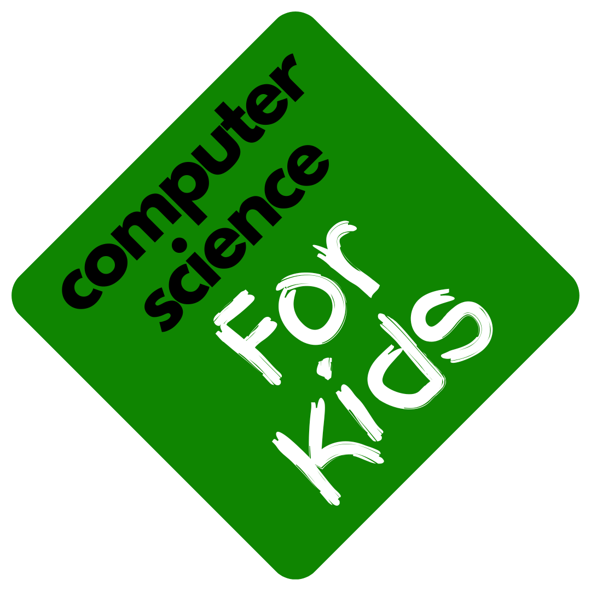

  
  
  <h2>Resources that help young learners explore computer science!</h2>
 
Unless otherwise noted, the educational content on featured sites is free. Content may require registering with the site, making an account, or downloading an application. If you have any questions or would like to add content to the repo, please email <a href="mailto:luke.m.balmer@vanderbilt.edu">luke.m.balmer@vanderbilt.edu</a>
 

# Contents
- [Pre-Reader Activities](#Pre-Reader-Activities)
- [K-3 Activities](#K-3-Activities)
- [4-8 Activities](#4-8-Activities)
- [Parent & Teacher Resources](#Parent-&-Teacher-Resources)

# Pre Reader Activities
- [Code.org Pre-Reader Express](https://studio.code.org/s/pre-express-2023) Full pre-reader programming course, including learning to drag/drop, sequencing, loops, and events, all for pre-readers
- [Code.org Maze Lesson](https://studio.code.org/s/course1/lessons/1/levels/1) Learn cardinal directions and grasp movement and snapping together blocks
- [Kodable Hour of Code](https://www.kodable.com/hour-of-code/self-guided) Game with a focus on engaging visuals and story for pre-readers, introducing drag/drop and sequencing
- [Bee-Bot](https://www.amazon.com/TTS-Bee-Bot-Programmable-Educational-Rechargeable/dp/B086HFXDSM) Programmable robot that moves along cardinal directions according to child's code - [Android App](https://play.google.com/store/apps/details?id=com.tts.beebot&pcampaignid=web_share) - [IOS](https://s.typingclub.com/docs/resources/digital-citizenship.html)
- [Lego Coding Express](https://education.lego.com/en-us/products/coding-express-by-lego-education/45025/) Lego set to introduce coding concepts to pre-readers and those in Kindergarten, comes with customizable blocks and 8 premade lessons, includes guides, training, and community support. $249.95
- [Code a Pillar](https://www.amazon.com/Fisher-Price-Think-Learn-Code-a-Pillar-Twist/dp/B07MLXX9NN) Comes with 8 segments that preschoolers can to “tell” the toy how to move, introducing computational thinking and sequencing. $110

# K-3 Activities
## Programming
- ScratchJr - [Android](https://play.google.com/store/apps/details?id=org.scratchjr.android&hl=en_US) - [IOS](https://apps.apple.com/us/app/scratchjr/id895485086)
- Tynker Junior - [Android](https://play.google.com/store/apps/details?id=com.tynker.TynkerIconCoding&hl=en_US) - [IOS](https://apps.apple.com/us/app/tynker-junior-coding-for-kids/id1393933000)
- [Code.org Hour of Code Activities](https://studio.code.org/catalog?marketingInitiative=hoc): Incredible variety of free browser-based lessons, including adventures in [Minecraft](https://studio.code.org/s/mc/lessons/1/levels/1), making art with Elsa from [Frozen](https://studio.code.org/s/frozen/lessons/1/levels/1), and learning about AI with a [Dance Party](https://studio.code.org/s/dance-ai-2023/lessons/1/levels/1)
- [Root Robot](https://edu.irobot.com/shop/coding-robots/root?variant=269694) Educational robot that learners can program via an app and use to draw on a mat, play games, or learn with lessons from the [Root Robot Learning Library](https://edu.irobot.com/learning-library?gradeValue=PreK-K&toggle=lessons). $100+ 

## Computer Science Fundamentals and Computational Thinking
- [Code.org CS Fundamentals Curricula](https://code.org/curriculum/csf#pick-a-course) Full CS foundations curricula available for learners, including the self-paced [Express](https://studio.code.org/s/express-2023/lessons/1/levels/1) course.

## Typing and Using Technology
- [Dance Map Typing](https://www.bbc.co.uk/bitesize/articles/z3c6tfr#zn9s3qt) Classic typing game for beginning typists
- [Typing Club Activities](https://www.typingclub.com/kids-typing) Multiple typing games convenient for practice

## Digital Citizenship and Cybersecurity
- [Digital Citizenship Course by Typing Club](https://s.typingclub.com/docs/resources/digital-citizenship.html) 
- [ABCYa Cyber5 Rules for Internet Safety Game](https://www.abcya.com/games/cyber_five_internet_safety) Short video for young learners about staying safe online, starring Hippo and Hedgehog
- [Band Runner](https://www.ceopeducation.co.uk/8_10/) Runner game where students can practice answers to digital citizenship questions

# 4-8 Activities
## Programming
- [Scratch](https://scratch.mit.edu/)
- [Tynker](https://www.tynker.com/)
- [Code.org Hour of Code Activities](): [Star Wars](https://studio.code.org/s/starwarsblocks/lessons/1/levels/1)
- [Root Robot 3-5](https://edu.irobot.com/learning-library?gradeValue=Grades%203-5&toggle=lessons)
- [Root Robot 6-9](https://edu.irobot.com/learning-library?gradeValue=Grades%206-9&toggle=lessons)

## Computer Science Fundamentals and Computational Thinking
- [Code.org](https://studio.code.org/catalog?grade=grade_4&grade=grade_5&grade=grade_6&grade=grade_7&grade=grade_8) Curricula

## Typing and Using Technology
- [typing.com](typing.com)
- [typingclub.com](typingclub.com)

## Exploring CS Fields

- [Science Buddies STEM CS Activities](https://www.sciencebuddies.org/stem-activities/subjects/computer-science/) Introductory unplugged lessons on AI, self-driving cars, cryptography, and more.

### Hardware & Electrical Engineering
- [LittleBits](https://classroom.littlebits.com/getting-started)
- [Arduino Student Kit](https://store-usa.arduino.cc/collections/kits/products/arduino-student-kit)
- [Arduino Edu Starter Kit](https://www.arduino.cc/education/edu-starter-kit/)
### Internet of Things
- [Arduino Oplà IoT Kit](https://store-usa.arduino.cc/collections/kits/products/arduino-opla-iot-kit)
### Cybersecurity and Digital Citizenship
- [Hour of Code: Encryption](https://studio.code.org/s/hoc-encryption/lessons/1/levels/1) Simple and accessible encryption lesson and game
- [Interland](https://beinternetawesome.withgoogle.com/en_us/interland) Learn how to navigate the Internet responsibly in this extensive game developed by Google
- [EducationArcade Games](https://www.educationarcade.co.nz/game-time) Variety of games about digital citizenship and online safety
- [picoCTF](https://picoctf.org/get_started.html) For students interested in going deeper into cybersecurity

# Parent & Teacher Resources
## Parents

## Teachers
